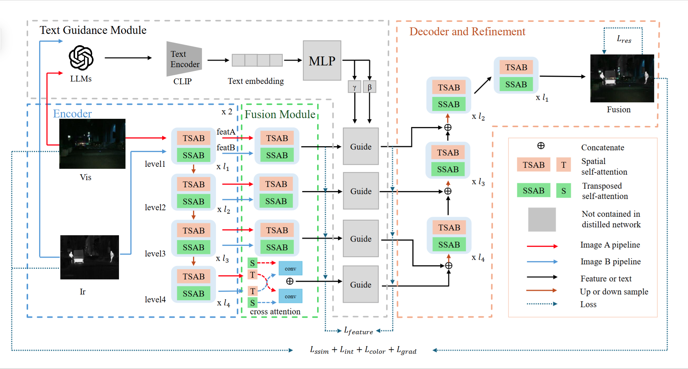
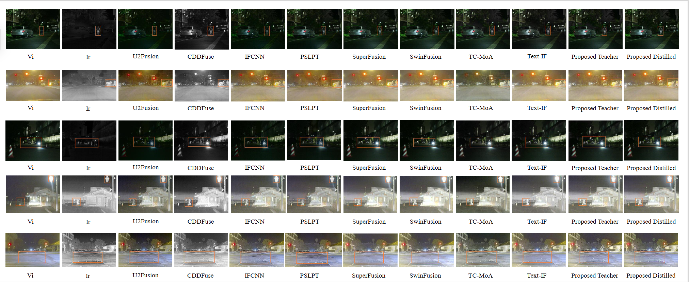
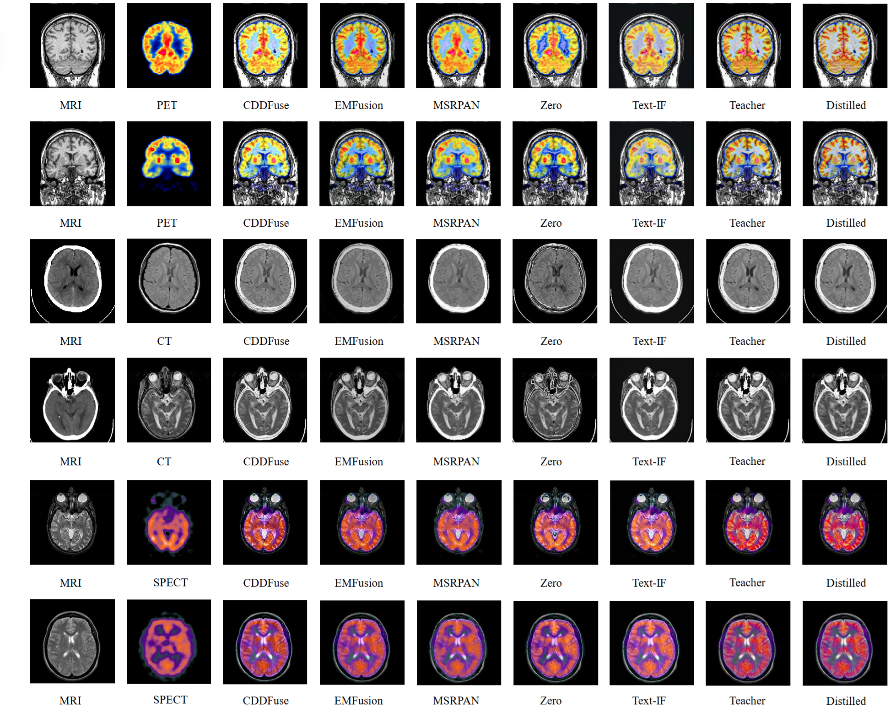

### Introduction

Source code for [Distilling Textual Priors from LLM to Efficient Image Fusion](https://ieeexplore.ieee.org/document/11219206)


### Requirements

We use `python 3.10.6` with pytorch 2.0.1, cuda 11.8 and lightning 2.2.0. The full environment can be found in `requirements.txt`. But it contains some packages that are not necessary for this project, so we recommend that you follow the guide below to install the key libraries and then go there to find the missing libraries from `requirements.txt` based on the error messages.

First, install the key libraries:

```bash
pip install torch==2.0.1+cu118 torchvision==0.15.2+cu118 torchaudio==2.0.2 --index-url https://download.pytorch.org/whl/cu118
pip install pytorch_lightning==2.2.0
```

If you got error about pytorch_lightning, you can replace it with `pip install lightning==2.2.0`, or edit the code to use: 
```python
import pytorch_lightning as pl # old version
import lightning.pytorch as pl # new version
```

Next, the clip should be installed by the following command:

```bash
pip install git+https://github.com/openai/CLIP.git
```

Then, run the following command to install the missing libraries:
```bash
pip install easydict, tensorboardX
```

If you still encounter some errors, you can install the missing libraries from `requirements.txt`. If you want to directly run the code by `pip install -r requirements.txt`, all testing was done on Ubuntu 22.04 LTS. 

### Data

We use the following datasets, you can download them from their official website. 

- MSRS, M3FD, RoadScene for ivf
- Havard Medical Image Fusion Datasets for medical

<!-- They are open-sourced, you can download them from the official websites or github repositories. Due to the size limit, we do not provide the data here.  -->

### Usage

#### Text Annotation

We provide the `anno` folder, which contains the example code for using qwen2-vl to generate text annotations for the images in the `data` folder. We suggest to generate the text before inference and training to save time. You can refer to [qwen2-vl](https://github.com/QwenLM/Qwen2-VL) for more details(Now suggest [qwen2.5-vl](https://github.com/QwenLM/Qwen2.5-VL)). The transformer and flash attention library are required. 

```bash
pip install transformers
pip install flash-attn==2.5.9.post1 --no-build-isolation 
# recommend to use this version if you have same pytorch and lighting version.  
```

The usage of the code can be found in argparse. It is recommended to change the parameters based on your own needs, so we do not provide the detailed usage here. If you encounter an error like `cuda out of memory. `, you can use AWQ or GPTQ quantization. 
```bash
pip install autoawq # for AWQ
pip install auto-gptq optimum # for GPTQ
```
```python
# Example code for loading quantized models (AWQ/GPTQ)

from transformers import AutoModelForCausalLM, AutoTokenizer

# Model repository path (Hugging Face Hub ID or local path)
model_path_awq = "path/to/your/qwen-vl-awq-model" # Assuming this is an AWQ quantized model
model_path_gptq = "path/to/your/qwen-vl-gptq-model" # Assuming this is a GPTQ quantized model

# Load Tokenizer (usually the same as the original model)
# Use either the AWQ or GPTQ path depending on which model you are loading below
tokenizer = AutoTokenizer.from_pretrained(model_path_awq, trust_remote_code=True)

# Load AWQ model (requires autoawq to be installed)
print("Loading AWQ model...")
model_awq = AutoModelForCausalLM.from_pretrained(
    model_path_awq,
    trust_remote_code=True,
    device_map="auto" # Automatically map to GPU
)
print("AWQ model loaded.")
# You can now use model_awq for inference
# ... perform inference ...
# del model_awq # Release GPU memory if needed

# Load GPTQ model (requires auto-gptq and optimum to be installed)
print("\nLoading GPTQ model...")
model_gptq = AutoModelForCausalLM.from_pretrained(
    model_path_gptq,
    trust_remote_code=True,
    device_map="auto" # Automatically map to GPU
    # For GPTQ, you might sometimes need to specify use_safetensors=True/False
    # use_safetensors=True # If the model uses the .safetensors format
)
print("GPTQ model loaded.")
# You can now use model_gptq for inference
# ... perform inference ...
# del model_gptq # Release GPU memory
```

#### Training and Testing

You can edit the `configs/Train_text_xrestormer.yaml` to change the parameters. Then, run the following command to start training:

```bash
python train.py --config configs/Train_text_xrestormer.yaml # train
python test.py --config configs/Train_text_xrestormer.yaml --test_all -i sliding_window # test
# Note that full_image mode may uses a lot of memory for large images, but sliding_window mode take up more time. 
```

### Pre-trained models

We provide a pre-trained distilled model for the IVF task in the `Experiments/EXP_IVF` folder. Due to size limitations, we do not include the teacher model. This model was trained on the MSRS dataset (note that all competing methods were trained exclusively on MSRS, with other datasets used solely for testing) and demonstrates superior generalization performance for IVF tasks. Notably, it maintains strong performance even on medical tasks outside its training scope, though the reported medical task metrics do not originate from this model. For medical datasets, you can train the model using `configs/Train_text_xrestormer_Med.yaml`.

<!-- ### Potential problems -->

<!-- The code are a checkout of a git repository in windows, the line breaks are CRLF.  -->

### Appendix

Compare with other methods:
IVF datasets:

Havard Medical Image Fusion Datasets:


If you find our work useful, please cite it as:
```
@ARTICLE{11219206,
  author={Zhang, Ran and He, Xuanhua and Cao, Ke and Liu, Liu and Zhang, Li and Zhou, Man and Zhang, Jie and Guo, Dan and Wang, Meng},
  journal={IEEE Transactions on Circuits and Systems for Video Technology}, 
  title={Distilling Textual Priors from LLM to Efficient Image Fusion}, 
  year={2025},
  volume={},
  number={},
  pages={1-1},
  keywords={Computational modeling;Image fusion;Semantics;Visualization;Training;Knowledge engineering;Computational efficiency;Large language models;Electronic mail;Computer architecture;Image Fusion;Knowledge Distillation;Large Language Models;Multi-modality Learning},
  doi={10.1109/TCSVT.2025.3626414}
}
```
